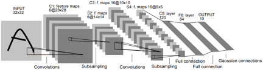

# Traffic-Sign-Classifier-P3
This project is the third project traffic signal classifier for the Udacity Self-driving car nanodegreys. The purpose of the project is as follows:
- Receive train data, validation data, and test data to learn, validate, and view final test accuracy
- To obtain more than 93% validation accuracy by modifying the CNN
- Test new photos with calculated models and detect classification results and accuracy

## Which CNN Model based on
  
The CNN used to create a traffic signal classifier is LeNet-5. The existing LeNet-5 structure consists of a pair of Convolution-Pooling layers and three Full Connected Layers as shown.

| Layer         		|     Description	        					|
|:---------------------:|:---------------------------------------------:|
| Input         		| 32x32x3 RGB image   							|
| Convolution 1     	| 1x1 stride, VALID padding, output = 28x28x6 	|
| RELU					|												|
| Max pooling	      	| 2x2 stride, VALID padding, output = 14x14x6   |
| Convolution 2  	    | 1x1 stride, VALID padding, output = 10x10x16  |
| RELU					|												|
| Max pooling	      	| 2x2 stride, VALID padding, output = 5x5x16    |
| Flatten				| output = 400									|
| Fully connected		| input = 400, output = 120       	            |
| RELU					|												|
| Fully connected		| input = 120, output = 84       	            |
| RELU					|												|
| Fully connected		| input = 84, output = 10       	            |

However, when we used this model as it was, the validation accuracy was approximately 89%, so we revised it a little bit.

| Layer         		|     Description	        					|
|:---------------------:|:---------------------------------------------:|
| Input         		| 32x32x3 RGB image   							|
| Convolution 1     	| 1x1 stride, VALID padding, output = 28x28x6 	|
| RELU					|												|
| Max pooling	      	| 2x2 stride, VALID padding, output = 14x14x6   |
| Convolution 2     	| 1x1 filter, 1x1 stride, VALID padding, output = 14x14x16 	|
| RELU					|												|
| Convolution 3  	    | 1x1 stride, VALID padding, output = 10x10x48  |
| RELU					|												|
| Max pooling	      	| 2x2 stride, VALID padding, output = 5x5x48    |
| Flatten				| output = 1728									|
| Fully connected		| input = 1728, output = 256       	            |
| RELU					|												|
| Fully connected		| input = 256, output = 128       	            |
| RELU					|												|
| Fully connected		| input = 128, output = 84       	            |
| RELU					|												|
| Fully connected		| input = 84, output = 43       	            |

Here's how you've tried to improve accuracy:
1. Modify Hyperparameter
1. Add 1*1 convolution layer
1. Add fully connected layer
1. Add dropout
1. Modify image normalization range
1. Initialize weight using another method

In conclusion, the methods used are 1, 2, and 3. The EPOCHS = 50 has the highest validation accuracy, with EPOCHS increasing from 10 to 200. Then we added a 1*1 convolution layer that reduces the amount of computation and adds nonlinearity, and we added nonlinearity by deepening the full connected layer.
```
We've run it many times and we've got the best results when EPOCHS = 50.
EPOCHS = 50  
BATCH_SIZE = 128  

The 1st Run
EPOCH 48 ...  
Validation Accuracy = 0.9566893424036281
EPOCH 49 ...  
Validation Accuracy = 0.9564625850340136
EPOCH 50 ...  
Validation Accuracy = 0.9562358276643991

The 2nd Run
EPOCH 48 ...  
Validation Accuracy = 0.9578231290084164
EPOCH 49 ...  
Validation Accuracy = 0.9578231290084164
EPOCH 50 ...  
Validation Accuracy = 0.9578231290084164
```

## Test Data Accuracy Measurement
```
Test Accuracy = 94%
```
The accuracy of the test data was approximately 94%. Next, let's look at the accuracy of the new data.

## Accuracy for new data
```
INFO:tensorflow:Restoring parameters from ./traffic_classi
Prediction: 17
Prediction: 13
Prediction: 17
Prediction: 17
Prediction: 14
Prediction: 13
Prediction: 38
Test Accuracy = 86%
```
It shows about 86 percent accuracy with the new data. Six out of seven are predicted to be correct.
